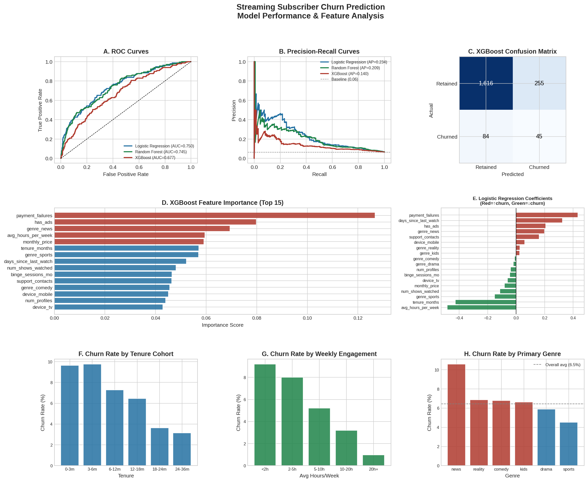
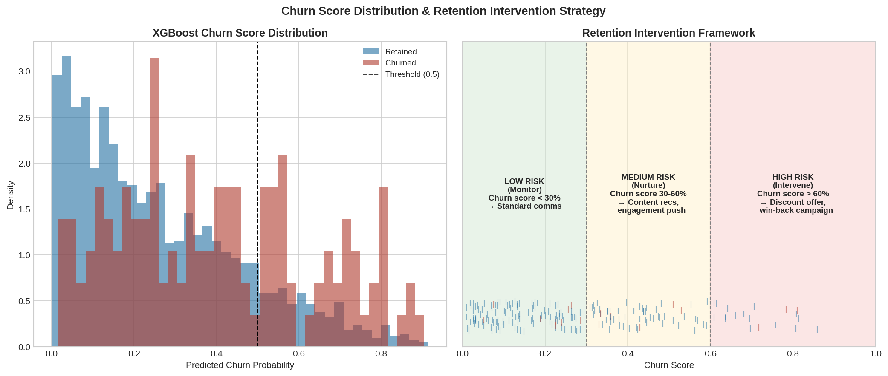

# Streaming Subscriber Churn Prediction
### Logistic Regression · Random Forest · XGBoost

A full machine learning pipeline predicting subscriber churn on a streaming platform,
with model comparison, feature analysis, and a business-facing retention strategy framework.

---

## Research Question

Which subscriber behaviors and content engagement patterns best predict churn — and how
can we use a churn score to prioritize retention interventions efficiently?

---

## Key Finding

All three models beat baseline (random classifier AUC = 0.065 under 6.5% churn rate).
Logistic Regression achieves **ROC-AUC = 0.750** with the most interpretable coefficients.
The top churn predictors are **payment failures**, **ad-supported plan**, and
**days since last watch** — actionable signals that map directly to retention levers.



---

## Dataset

Simulated streaming subscriber data: **10,000 subscribers · 18 features · 6.5% monthly churn**

Features mirror what streaming platforms track operationally:

| Category | Features |
|----------|----------|
| Plan | Tenure, plan type, monthly price, ad-supported |
| Engagement | Hours/week, shows watched, binge sessions, days since last watch |
| Platform | Number of profiles, device type |
| Signals | Support contacts, payment failures |
| Content | Primary genre (drama, comedy, sports, reality, kids, news) |

Churn rate calibrated to published streaming industry benchmarks (5–8% monthly).

---

## Models & Results

| Model | ROC-AUC | Avg Precision |
|-------|---------|---------------|
| Logistic Regression | 0.750 | 0.234 |
| Random Forest | 0.746 | 0.209 |
| XGBoost | 0.677 | 0.140 |

*Average Precision is the primary metric — it reflects performance under class imbalance.
A random classifier would score 0.065 (the base churn rate). All three models substantially
exceed baseline.*

---

## Retention Strategy Framework



Subscribers are segmented into three intervention tiers based on churn score:

| Tier | Score | Action |
|------|-------|--------|
| Low Risk | < 30% | Standard communications, content recommendations |
| Medium Risk | 30–60% | Personalized engagement push, series completion nudges |
| High Risk | > 60% | Discount offer, win-back campaign, priority support |

---

## Repository Structure

```
streaming-churn-prediction/
├── churn_model.ipynb        # Full analysis: data, models, evaluation, recommendations
├── churn_model.py           # Standalone Python script
├── churn_main.png           # 8-panel model performance + feature analysis chart
├── churn_strategy.png       # Score distribution + retention intervention framework
└── README.md
```

---

## How to Run

**Requirements**
```bash
pip install numpy pandas matplotlib scikit-learn xgboost jupyter
```

**Option 1 — Jupyter Notebook**
```bash
jupyter notebook churn_model.ipynb
```

**Option 2 — Python script**
```bash
python churn_model.py
```

---

## Key Insights

1. **Payment failures** are the single strongest churn predictor — an automated
   win-back sequence within 24 hours of a failed charge should be table stakes.
2. **Early-tenure subscribers (0–3 months)** churn at the highest rate — structured
   onboarding with personalized content recommendations could meaningfully reduce cancellations.
3. **Sports viewers and multi-profile households** are the stickiest segments —
   content and plan features that deepen household-level adoption improve retention.
4. **Low engagement is a leading indicator** — subscribers watching fewer than 2 hours/week
   show churn rates 3–4× the platform average.

---

## Author

Karen Colman Martinez · kcolmanmartinez@smith.edu · [linkedin.com/in/karenvcolmanmartinez](https://www.linkedin.com/in/karenvcolmanmartinez/)
